Soldering 101 and build instructions
====================================

Cool, you're starting over with soldering! This through hole kit is perfect for that. 
As you don't have much experience with soldering we'll go through some of the lowly basics here.

Safety first: 

- be careful with the soldering and melted solder. They can cause severe burns!
- don't inhale the soldering fumes. 
- wash your hands after soldering. Solder can contain lead, zinc, other metals and flux, neither of which you should ingest!

To solder this board you'll need:

- a soldering iron / most will make do for this job.
- solder / 1mm with flux/rosin core or anything you're comfy with
- wire cutting pliers / snips
- some fire proof surface to solder on

> Note: about the work table you're going to solder on: clean it up and have some space to work.
> Don't have any easy to burn material or substance close. If you don't mind having a burnt trace on it
> most furniture will be *fine* but you may want to add some throw-away-able layer on top ;)
>
> There are some amazing and cheap soldering mats available, otherwise a scrap wood panel will do.

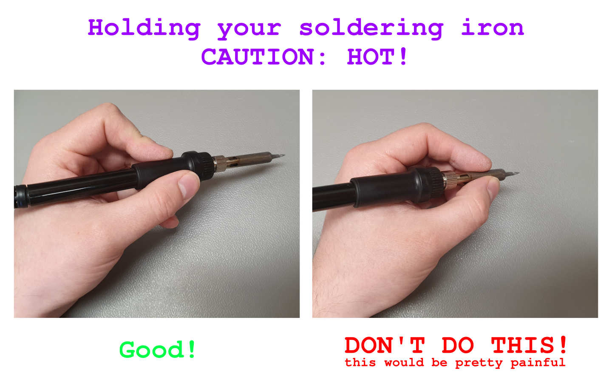

Power up your soldering iron (if it's regulated set the temperature to anywhere between 260°C and 350°C - depending on your solder) and wait for it to be at the right temperature. 

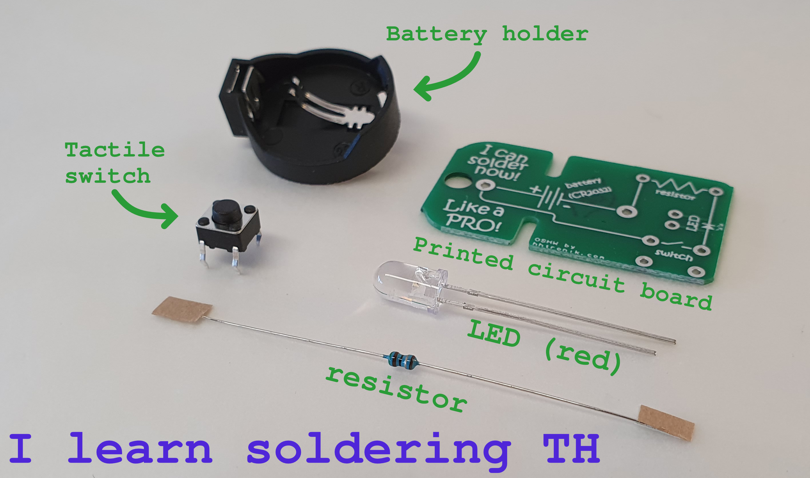

While the soldering iron is heating up, prepare your first part:

- remove the paper strips on the lead wires of the resistor (just pull :)
- bend the wires of the resistor at a right angle so they fit through the pads on the PCB. 

To ease getting the width right we added the slots to the PCB, hold the resistor in between the slots like this and pull the lead wires through the slots:

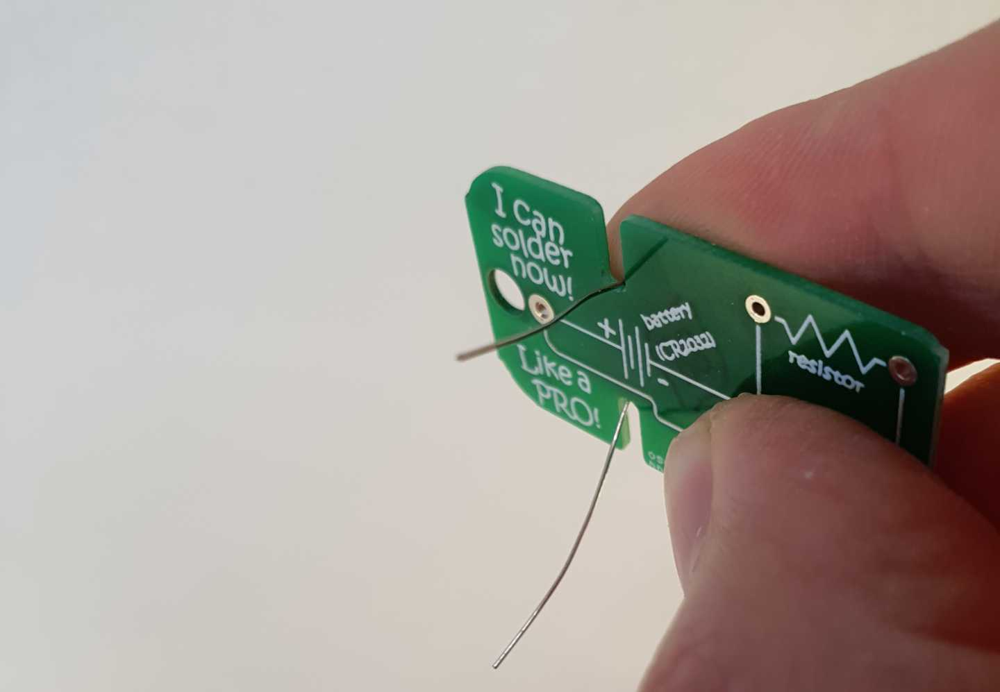

Now put the resistor in place by sliding the leads through the holes. The resistor should sit flush to the board. Now bend the lead wires that stick out on the bottom side a bit to prevent the resistor falling out, like so:

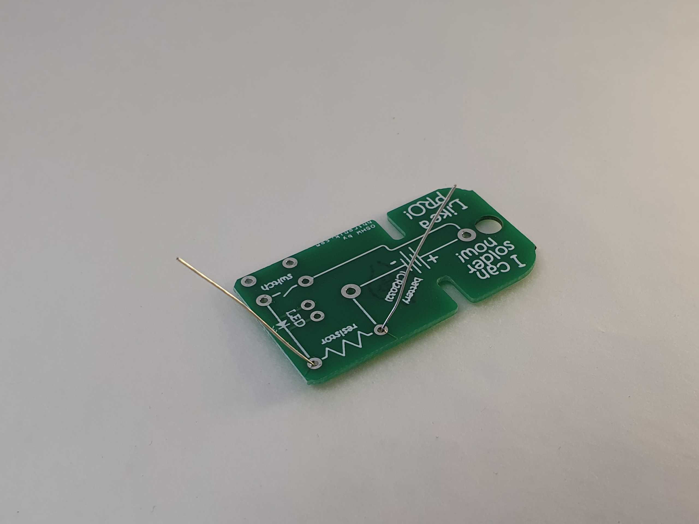

By now the soldering iron should be up to temperature! You can check this by holding a bit of solder to the tip (keep your fingers at least a few centimeters away from the tip though). If the solder niceley melts and flows on the tip you're ready to go! 

If you ended up with a huge blob of solder on the tip of the iron, you can get rid of it by using some solder wick. Alternatively you can gently tap the soldering iron (the whole unit, not the tip) on the work surface to make to molten solder drop off. Be careful with the projections though! It's *hot and molten* metal!

> Note: if the solder makes crackling noises and/or you have flux projections that means that your iron is too hot! 
> If the solder does not melt, then it's either set too low or not yet fully heated up.

Resistors are a great first component to solder because you can't really go wrong with over-heating or melting them, so take your time! Touch the pad on the PCB *and* the lead wire simultaneaously to heat up both, then flow 1-2mm of solder onto the joint.

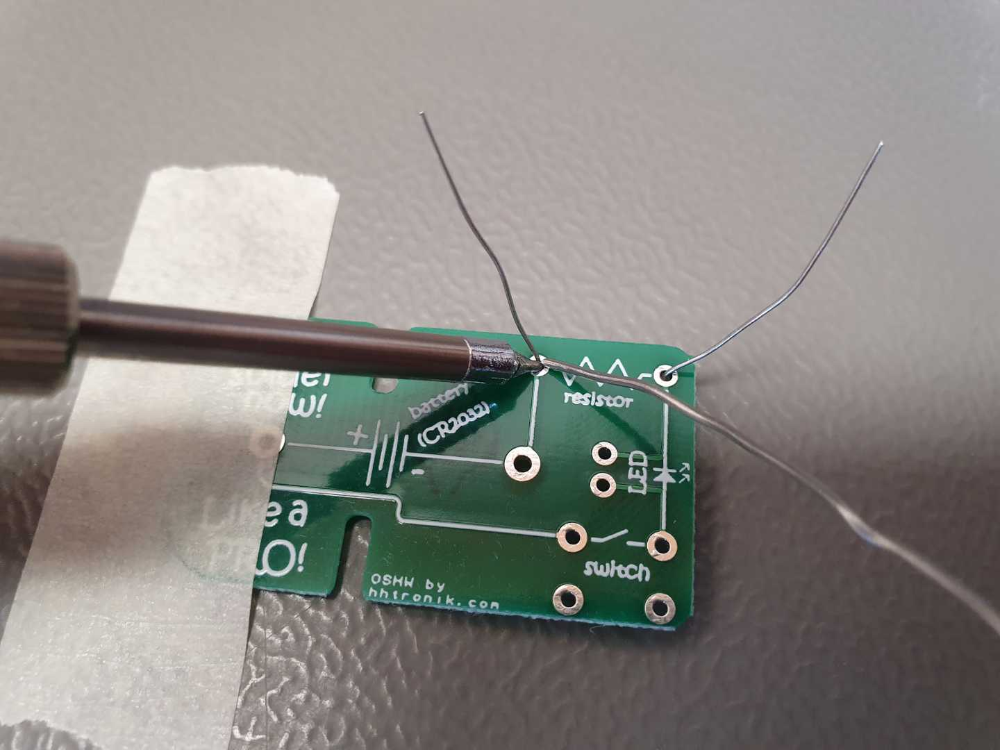

Remove the solder wire first, then the soldering iron. As you see I taped down the PCB with a bit of painters tape in the shot above so it stays in place while soldering.

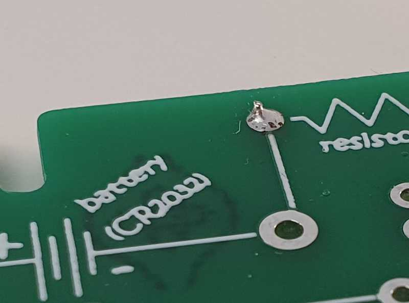

If you've got something similar to this, repeat for the second solder joint.

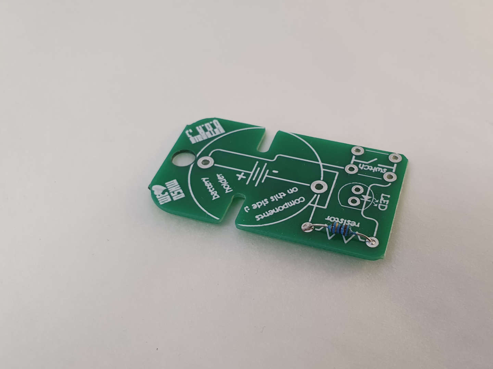

**Next, on to the LED!**

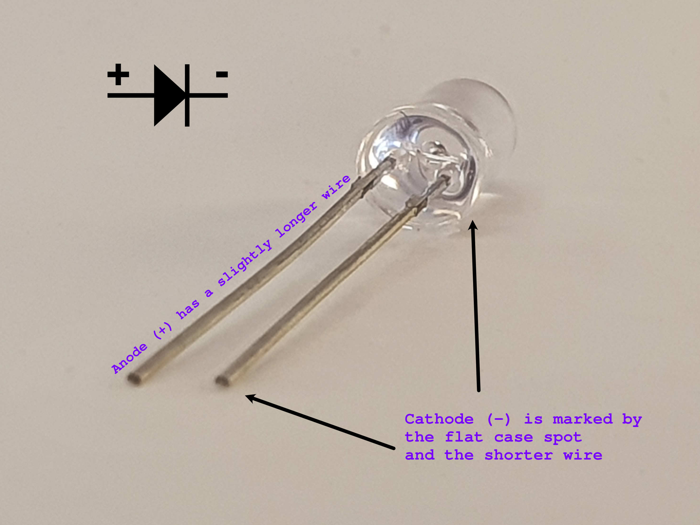

There are two things to know here! First of all, LEDs are polarized components, meaning that the orientation you solder them matters. This is because they are (**L**ight **E**mitting) **D**iodes which can conduct ("pass current") only in one direction. The picture above should help you figure out the polarity of the LED in your kit.

The second thing to know is that LEDs are more sensitive to heat than the resistor you just soldered. This means that you shouldn't hold the soldering iron to its wire for minutes at a time (ideally you should be done in seconds). If you took a long time to solder one of the leads, wait a few seconds to allow it to cool down before moving on!

in order to make your soldering kit a flashlight pointing forward, we want to bend the pins at a 90° angle about 1cm from the LED body. To do so, insert it in the footprint marked `LED` on the PCB and bend it over. Then give the leads another bend below the PCB so the LED can't fall out:

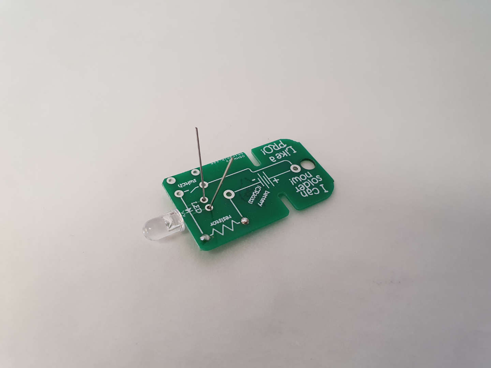

Now solder it down as you've practiced with the resistor.

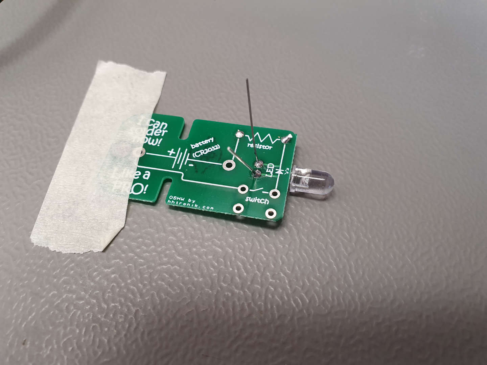

**Repeat for the switch**

The switch allows you to close the circuit and thus to light the LED when you want it. It's pretty easy to solder, but again, as the case is made out of plastic, you don't want to totally toast it ;) Give it a few seconds to cool down in between the solder joints and you'll be fine!

The switch can be inserted in two orientations (basically rotated by 180°), you shouldn't have to bend any pins to insert it into its pads!

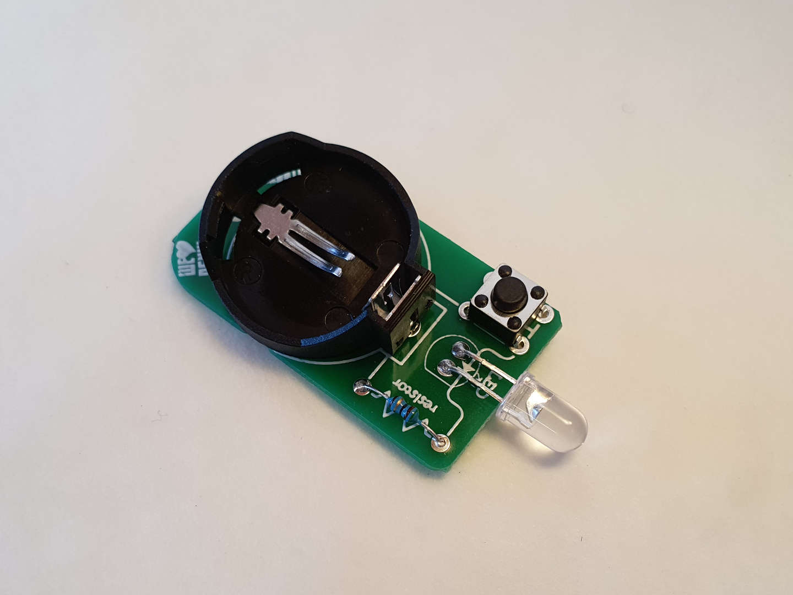

If you fancy, you can add the battery holder as well at the same time and solder all of these in one go! The battery holder's polarity does matter, so make sure to align the PCB marking and the retainer notch of the battery clip! 

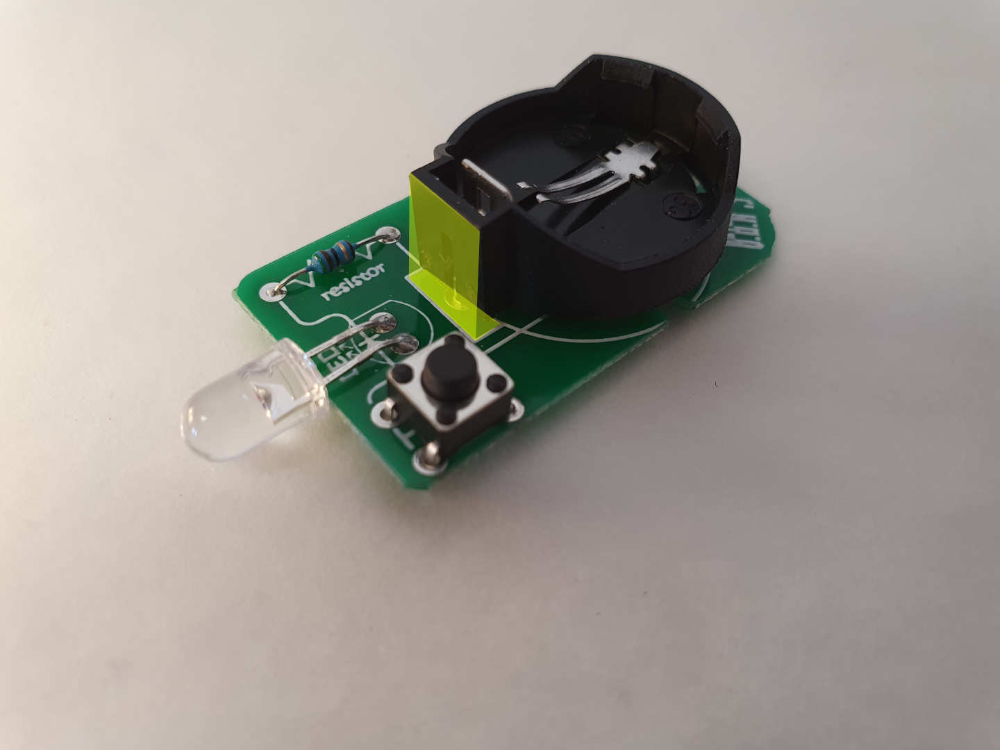

Solder all joints you still need to make.

If everything looks fine to you you can trim off the excess lead wire lengths, insert a coin cell (positive terminal / + facing away from the PCB) into the battery holder and press the button. 

...and hopefully enjoy your new red keychain flashlight :)

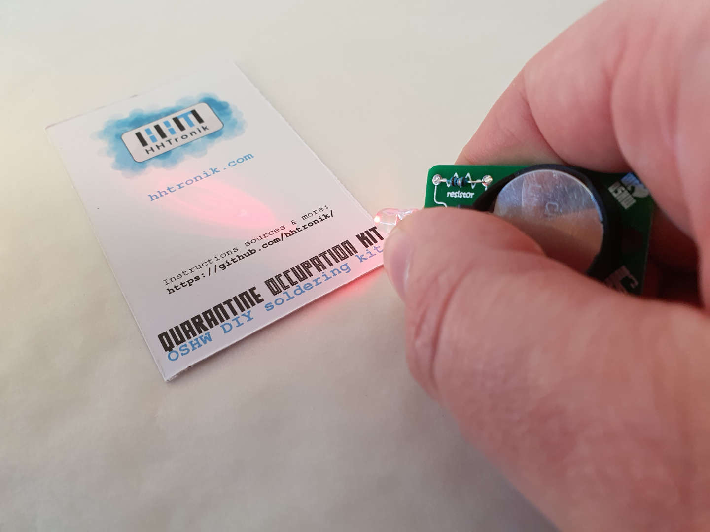

Troubleshooting
===============

See troubleshooting section in [README](./README.md)